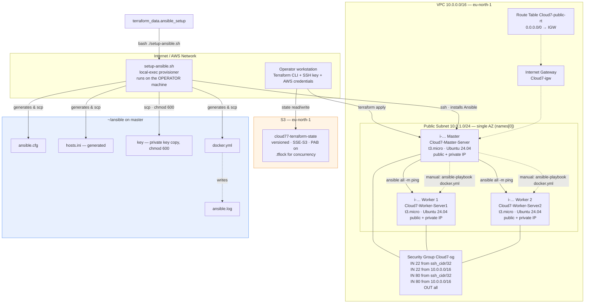

# AWS EC2 Fleet with Hybrid Bash + Ansible Bootstrap

Provision a three-node Ubuntu 24.04 EC2 fleet on AWS with Terraform, then configure
it through **two deliberately different automation paths** so the trade-offs between
imperative shell bootstrapping and declarative configuration management are visible
side by side.

| Node | Provisioned by | Configured by | Role |
|---|---|---|---|
| `Cloud7-Master-Server` | Terraform | `setup-ansible.sh` (Bash over SSH) | Ansible control node. Runs `apt-get install ansible`, hosts the inventory, private key and playbooks. |
| `Cloud7-Worker-Server1` | Terraform | `docker.yml` (Ansible playbook) | Managed node. Receives Docker Engine + Compose, then runs an nginx container on port 80. |
| `Cloud7-Worker-Server2` | Terraform | `docker.yml` (Ansible playbook) | Managed node. Receives Docker Engine + Compose, then runs an nginx container on port 80. |

Everything is declared in HCL. There are no hard-coded instance IDs, no manual console
clicks after `terraform init`, and no per-node shell divergence — the two workers are
produced by a single `count = 2` resource, so they are guaranteed identical.

> **Status:** functionally complete and applied. Both Terraform root modules pass
> `terraform validate`. This repository is published for **public technical review**;
> see [Known Issues](docs/KNOWN-ISSUES.md) for a frank list of defects that reviewers
> are explicitly invited to critique, and [Security](docs/SECURITY.md) for the threat
> model.

---

## Table of Contents

- [What This Builds](#what-this-builds)
- [Architecture at a Glance](#architecture-at-a-glance)
- [The Three-Stage Bootstrap Model](#the-three-stage-bootstrap-model)
- [Repository Layout](#repository-layout)
- [Prerequisites](#prerequisites)
- [Quick Start](#quick-start)
- [Configuration Reference](#configuration-reference)
- [Outputs Reference](#outputs-reference)
- [Verification](#verification)
- [Cost](#cost)
- [Design Decisions and Alternatives Rejected](#design-decisions-and-alternatives-rejected)
- [Evidence](#evidence)
- [Documentation Index](#documentation-index)
- [Known Issues](#known-issues)
- [Contributing](#contributing)
- [License](#license)

---

## What This Builds



### Network path summary

| Flow | Protocol | Path |
|---|---|---|
| Operator → master | SSH/22 | Internet → IGW → public RT → master public IP. Permitted only from `var.ssh_cidr`. |
| Operator → workers | SSH/22 | Also permitted from `var.ssh_cidr`, because one security group is shared by all three nodes. Ansible (master → worker, private IPs) is the intended path, but direct operator → worker SSH is *not* blocked. See [SECURITY.md § S4](docs/SECURITY.md#s4--no-lateral-movement-containment). |
| Master → workers | SSH/22 | VPC-internal (`10.0.0.0/16` ingress rule) → worker **private** IPs. No IGW traversal. |
| Operator → workers | HTTP/80 | Reaches the nginx container on each worker, from `var.ssh_cidr` and from inside the VPC only. |
| Worker → Internet | HTTPS/443 | Egress `0.0.0.0/0` via IGW. Required to reach `download.docker.com`. |

---

## Architecture at a Glance

| Resource | Type | File | Key detail |
|---|---|---|---|
| `terraform` block | backend `s3` | `providers.tf` | Bucket `cloud77-terraform-state`, key `terraform.tfstate`, `encrypt = true`, `use_lockfile = true` |
| `provider.aws` | provider | `providers.tf` | `region = var.region`. No `default_tags`, no profile/role. |
| `data.aws_availability_zones.available` | data source | `networking.tf` | `state = "available"`. Ordered, **not** sorted. |
| `aws_vpc.main` | VPC | `networking.tf` | `cidr_block = var.vpc_cidr`, `enable_dns_hostnames = true` |
| `aws_internet_gateway.igw` | IGW | `networking.tf` | Attached implicitly via the public route table |
| `aws_subnet.public` | Subnet | `networking.tf` | `map_public_ip_on_launch = true`, single AZ |
| `aws_route_table.public` | Route table | `networking.tf` | Inline `0.0.0.0/0` → IGW route |
| `aws_route_table_association.public` | Association | `networking.tf` | Subnet ↔ route table |
| `aws_security_group.ec2` | Security group | `firewall.tf` | 4 ingress rules (22 and 80, each from `ssh_cidr` and `vpc_cidr`), 1 unrestricted egress rule |
| `aws_key_pair.ansible` | EC2 key pair | `firewall.tf` | `key_name = "${var.project}-ansible"`, so `Cloud7-ansible` with the shipped values |
| `data.aws_ssm_parameter.ubuntu` | data source | `compute.tf` | Canonical's `24.04/stable/current/amd64/hvm/ebs-gp3` AMI ID |
| `aws_instance.master_node` | Instance | `compute.tf` | Control node, always `count`-independent so its address is stable in outputs |
| `aws_instance.worker_node` | Instance ×2 | `compute.tf` | `count = 2`, indexed `Name` tags |
| `terraform_data.ansible_setup` | provisioner trigger | `ansible.tf` | `triggers_replace` on master IP, worker IPs, `filesha256` of `setup-ansible.sh`, `docker.yml` and `requirements.yml` |
| `local-exec` provisioner | provisioner | `ansible.tf` | Invokes `bash ./setup-ansible.sh` with `working_dir = path.module` |

The `remote_state/` subdirectory is a **separate, self-contained root module** whose only
job is to create the S3 bucket that `infrastructure/` depends on. It has no backend of its own
(bootstrap paradox), no variables and no `.tfvars` — the bucket name and region are literals
in `main.tf`, because `infrastructure/providers.tf`'s `backend` block cannot read `var.*` and
so could never follow a change here. Its state is local.

---

## The Three-Stage Bootstrap Model

This is the part of the project most worth reviewing, because the boundary between the
three stages is a deliberate design decision rather than an accident.

### Stage 1 — Terraform provisions instances (`compute.tf`)

Terraform creates the VPC, networking, security group, key pair and three instances.
It stops there. It does **not** configure the operating system of any node.

### Stage 2 — Bash bootstraps the control node (`setup-ansible.sh`)

A `local-exec` provisioner on `terraform_data.ansible_setup` calls the script from the
operator's machine. The script:

1. **Resolves inputs** — master IP, worker IPs and SSH key path. Values arrive as CLI
   flags from Terraform. If any are missing (manual invocation), it falls back to parsing
   `terraform output -json` with `python3`.
2. **Resolves the key** through `resolve_key()`, which tries the literal path, `~`
   expansion, backslash normalisation, a Git-Bash-on-Windows translation to
   `/mnt/c/...`, `$HOME/.ssh/<basename>`, `$USERPROFILE/.ssh/<basename>`, and finally a
   glob over `/mnt/*/Users/*/.ssh/` and `/mnt/*/home/*/.ssh/`.
3. **Hardens the key locally** — copies it to a `chmod 700` `mktemp -d`, `chmod 600`s the
   copy, and verifies OpenSSH will accept it via `ssh-keygen -y` before proceeding. The
   copy is removed by an `EXIT` trap.
4. **Waits for SSH** — up to 30 attempts, 10 s apart (≈300 s ceiling), tolerating the gap
   between `terraform apply` reporting success and `cloud-init` releasing port 22.
5. **Installs Ansible** on the master with `apt-get update && apt-get install -y ansible python3`,
   then installs the collections in `requirements.yml` with
   `ansible-galaxy collection install -r`.
6. **Generates configuration** on the master: `ansible.cfg`, `hosts.ini` (built from the
   worker IPs), and a copy of `docker.yml`. It `scp`s all three plus the private key, then
   `chmod 600`s the key.
7. **Verifies reachability** with `ansible all -m ping`.

`ansible.cfg` written to the master:

```ini
[defaults]
inventory = /home/ubuntu/ansible/hosts.ini
host_key_checking = False
ssh_known_hosts_check = False
retry_files_enabled = False
stdout_callback = yaml
interpreter_python = auto_silent
forks = 10
log_path = /home/ubuntu/ansible/ansible.log

[ssh_connection]
pipelining = True
ssh_args = -o ControlMaster=auto -o ControlPersist=60s -o StrictHostKeyChecking=accept-new
```

> `host_key_checking = False` stops Ansible injecting `StrictHostKeyChecking=yes`, which would
> otherwise override the `accept-new` in `ssh_args` and make the first `ansible all -m ping`
> fail with `Host key verification failed`. With these settings Ansible TOFU-verifies: it
> records a key on first contact and refuses a *changed* key afterwards. That is stronger than
> the `StrictHostKeyChecking=no` this script originally used, and weaker than distributing
> host keys out of band — see [KI-08](docs/KNOWN-ISSUES.md#ki-08).

`hosts.ini` written to the master:

```ini
[workers]
worker-01 ansible_host=10.0.1.<n>
worker-02 ansible_host=10.0.1.<m>

[workers:vars]
ansible_user=ubuntu
ansible_ssh_private_key_file=/home/ubuntu/ansible/key
ansible_become=true
ssh_public_key=ssh-ed25519 AAAA… <comment>
```

> **Note:** `hosts.ini` contains only the workers. The master is not an inventory host, and
> the playbook now targets the `workers` group explicitly, so it resolves to the two workers
> **only**. Docker is therefore never installed on the control node. This is intentional —
> the control node runs the automation, the workers run the workloads — but it is a common
> source of confusion and was called out in [Known Issues](docs/KNOWN-ISSUES.md#ki-09).

### Stage 3 — Ansible configures the workers (`docker.yml`)

Ansible is now installed and the inventory is populated, so control moves to a playbook.
The operator runs it manually on the master:

```bash
ssh ubuntu@<master_public_ip>
cd ~/ansible && ansible-playbook docker.yml
```

The playbook adds Docker's official apt repository (verified by GPG key in
`/etc/apt/keyrings/docker.asc`), installs `docker-ce`, `docker-ce-cli`, `containerd.io`,
`docker-compose-plugin` and `python3-docker`, starts and enables the service, then runs an
`nginx:stable` container published on port 80 and verifies it answers locally.

Port 80 is reachable from your `/32` and from inside the VPC only — see
[Network path summary](#network-path-summary). The playbook's own verification checks
`localhost` from inside the worker, so a green run does **not** prove external reachability;
that depends on the security group. See [KI-18](docs/KNOWN-ISSUES.md#ki-18).

> The playbook calls `community.docker.docker_container`. That dependency is declared in
> [`requirements.yml`](infrastructure/requirements.yml) and installed explicitly by
> `setup-ansible.sh` step 4/6 with `ansible-galaxy collection install -r requirements.yml`,
> run **on** the master against the copy the script has just uploaded. It used to be
> implicit, riding along in Ubuntu's `ansible` package — see
> [P13](docs/KNOWN-ISSUES.md#playbook-quality-issues).

### Why this split?

The circular dependency is the reason, and it is worth stating plainly: **you cannot use
Ansible until Ansible exists, and you cannot install Ansible with Ansible.** Something
outside Ansible has to install Ansible and hand it an inventory. That "something" is
`setup-ansible.sh`. Once it has run, the cost of the imperative path has been paid, and
everything *downstream* is better served by a declarative, idempotent, re-runnable
playbook. The project keeps both halves visible so the boundary is auditable.

The trade-off accepted by this design: **Stage 2 is not idempotent.** Re-running the script
reinstalls packages and rewrites configuration from scratch. That is acceptable for a
one-time bootstrap and is documented rather than hidden.

---

## Repository Layout

```text
.
├── README.md                        ← you are here
├── LICENSE                          MIT
├── CONTRIBUTING.md
├── Makefile                         convenience targets (fmt/validate/plan/apply)
├── .gitignore                       hardened — see KNOWN-ISSUES § KI-02
├── .gitattributes                   forces LF so the shell script survives CI
│
├── infrastructure/                  ← the main root module; run terraform with -chdir
│   ├── .terraform.lock.hcl          provider pins — committed on purpose
│   ├── terraform.tfvars             ← git-ignored, your real values
│   ├── terraform.tfvars.example     ← committed, safe template
│   ├── providers.tf                 terraform block, S3 backend, AWS provider
│   ├── variables.tf                 all 9 input variables
│   ├── networking.tf                VPC, IGW, subnet, route table, association
│   ├── compute.tf                   Ubuntu AMI lookup, master + 2 workers
│   ├── firewall.tf                  security group + EC2 key pair
│   ├── ansible.tf                   terraform_data + local-exec provisioner
│   ├── outputs.tf                   6 outputs
│   ├── setup-ansible.sh             Stage 2 — control-node bootstrap (Bash, ~245 lines)
│   ├── docker.yml                   Stage 3 — worker configuration (Ansible playbook)
│   └── requirements.yml             Ansible collection dependencies (community.docker)
│
├── remote_state/                    separate root module: bootstrap the state bucket
│   ├── main.tf                      S3 bucket, versioning, SSE, public-access-block
│   └── outputs.tf                   bucket_name, region (both hard-coded in main.tf)
│
├── docs/                            ~5,300 lines of design rationale and runbooks
│   ├── ARCHITECTURE.md              resource-by-resource design rationale
│   ├── DEPLOYMENT.md                step-by-step deploy with expected output
│   ├── OPERATIONS.md                runbook: day-2, scaling, teardown, rotation
│   ├── SECURITY.md                  threat model + 15 findings + remediation plan
│   ├── KNOWN-ISSUES.md              20 defects with severity, status and patches
│   ├── COST.md                      cost model and teardown economics
│   └── REVIEW-CHECKLIST.md          guided appraisal for reviewers
│
└── screenshots/                     terminal captures from the working deployment
```

33 tracked files. Nothing under `.terraform/`, no `terraform.tfvars`, no state, no keys.

> **The main root module lives in `infrastructure/`.** Every command in these docs is written
> from the repository root using `terraform -chdir=infrastructure …`, which works with
> Terraform ≥ 0.14. If you prefer to `cd` around instead, use `cd infrastructure` for the
> main module and `cd remote_state` for the bootstrap module — never mix the two.
> `remote_state/` is a **separate** root module with its own state; it is never referenced
> from `infrastructure/`.

**There is no CI.** Every check documented here is a local command you run yourself — see
[`make check`](#verification) and [CONTRIBUTING.md § Before you open a PR](CONTRIBUTING.md#before-you-open-a-pr).

---

## Prerequisites

| Requirement | Version | Notes |
|---|---|---|
| Terraform CLI | **≥ 1.10** (1.15.8 used) | `use_lockfile` and `terraform_data` both require ≥ 1.10 / ≥ 1.4. See [KI-01](docs/KNOWN-ISSUES.md#ki-01). |
| AWS CLI | v2 | Optional. Only for manual verification in the doc examples. |
| AWS credentials | — | Any method the AWS provider supports: env vars, `~/.aws/credentials`, SSO, or `AWS_PROFILE`. **Prefer SSO or an assumed role over long-lived IAM user keys.** |
| Permissions | — | `ec2:*` on the target VPC, `s3:*` on the state bucket, `iam:PassRole` if you later add instance profiles. |
| SSH key pair | ed25519 | `~/.ssh/id_ed25519` + `.pub`. Must exist **before** `terraform apply`. |
| GNU bash | ≥ 4.4 | `setup-ansible.sh` needs `mapfile`, `declare -A`-free arrays and `${var,,}` (bash 4+). |
| OpenSSH client | ≥ 8.0 | `ssh`, `scp`, `ssh-keygen`. |
| Python 3 | ≥ 3.8 | Only needed on the **local** machine, and only when invoking `setup-ansible.sh` manually without `-m`/worker IPs. |
| `make` | optional | Only if you use the `Makefile` shortcuts. |

**Generate the SSH key if you have not already:**

```bash
ssh-keygen -t ed25519 -a 100 -C "cloud7-ansible" -f ~/.ssh/id_ed25519
```

**Confirm the working directory is a POSIX-ish shell.** On Windows the script is intended
to run under Git Bash or WSL, because `local-exec` on Windows cannot export environment
variables to the child process. The `-K` flag (see [Stage 2](#stage-2--bash-bootstraps-the-control-node-setup-ansiblesh))
is the workaround, and `resolve_key()` exists to bridge `C:\Users\…` to `/mnt/c/Users/…`.

---

## Quick Start

> Full detail, including every expected line of output and every failure mode, is in
> **[docs/DEPLOYMENT.md](docs/DEPLOYMENT.md)**. This is the condensed version.

### Step 0 — Configure

```bash
cp infrastructure/terraform.tfvars.example infrastructure/terraform.tfvars
```

Set at minimum:

```hcl
region             = "eu-north-1"
vpc_cidr           = "10.0.0.0/16"
public_subnet_cidr = "10.0.1.0/24"
instance_type      = "t3.micro"
project            = "Cloud7"
ssh_cidr           = "<your-public-ip>/32"   # find yours: https://checkip.amazonaws.com
public_key_file    = "~/.ssh/id_ed25519.pub"
private_key_file   = "~/.ssh/id_ed25519"
```

> `ssh_cidr` is marked `sensitive = true` in `variables.tf` and `terraform.tfvars` is
> git-ignored, so your IP is not committed. **Do not** paste it into a PR, an issue, or a
> screenshot.

### Step 1 — Bootstrap the state bucket (once per account/region)

```bash
cd remote_state
terraform init
terraform apply -auto-approve
```

Expected: an S3 bucket named `cloud77-terraform-state` with versioning, SSE-S3 and all four
public-access-block flags enabled. There are no variables or `.tfvars` here — the bucket name
and region are literals in `main.tf`. Record the `bucket_name` output.

> This module has **no backend** — its state is a local `terraform.tfstate`. Back it up
> before deleting it. See [KI-06](docs/KNOWN-ISSUES.md#ki-06).

### Step 2 — Deploy the fleet

```bash
cd ..
terraform -chdir=infrastructure init      # initialises the S3 backend; asks to import existing state if present
terraform -chdir=infrastructure plan      # review carefully — first plan creates 8 resources
terraform -chdir=infrastructure apply
```

`terraform apply` performs the following in one run:

1. Creates VPC, IGW, subnet, route table, association, security group, key pair.
2. Creates the master and both workers from the Canonical SSM AMI parameter.
3. Runs `setup-ansible.sh`, which installs Ansible on the master and generates the inventory.
4. Prints the six outputs.

Watch for the script's six progress markers:

```text
==> 1/6 Resolving master, workers and key
==> 2/6 Waiting for SSH on the master
==> 3/6 Installing Ansible on the master
==> 4/6 Copying the configuration and installing collections
==> 5/6 Verifying Ansible can reach the workers
==> 6/6 Done
```

### Step 3 — Configure the workers

```bash
ssh -i ~/.ssh/id_ed25519 ubuntu@$(terraform -chdir=infrastructure output -raw master_public_ip)
cd ~/ansible
ansible all -m ping          # expect worker-01 and worker-02 to return SUCCESS
ansible-playbook docker.yml  # expect changed=7 on each worker (8 tasks + fact gathering)
```

### Step 4 — Verify

```bash
ansible worker-01 -m command -a "docker --version && docker run --rm hello-world"
```

Expected on both workers:

```text
Docker version 27.x.x, build …
ubuntu: Unable to find image 'hello-world:latest' locally
latest: Pulling from library/hello-world
…
hello from Docker!
```

---

## Configuration Reference

All variables live in [`variables.tf`](infrastructure/variables.tf). Values come from
`infrastructure/terraform.tfvars`.

| Variable | Type | Default | Required | Description |
|---|---|---|---|---|
| `region` | `string` | — | ✅ | AWS region for both the provider and the backend. |
| `vpc_cidr` | `string` | — | ✅ | CIDR for the VPC. Also used as the *intra-VPC SSH* source range, so widening it widens who can SSH between nodes. |
| `public_subnet_cidr` | `string` | — | ✅ | CIDR for the single public subnet. |
| `instance_type` | `string` | — | ✅ | EC2 instance type for all three nodes. `t3.micro` by default. |
| `project` | `string` | — | ✅ | Prefix for every `Name` tag and the security group / key pair names. |
| `ssh_cidr` | `string` | — | ✅ `sensitive` | Your own `/32` address. The only external source allowed to reach SSH/22 or HTTP/80 — and because the security group is shared, it covers the workers as well as the master. |
| `public_key_file` | `string` | `~/.ssh/id_ed25519.pub` | ❌ | Passed to `file()` and uploaded to the EC2 key pair. |
| `private_key_file` | `string` | `~/.ssh/id_ed25519` | ❌ | Used by the `local-exec` provisioner and by `setup-ansible.sh` for SSH. |
| `ssh_user` | `string` | `ubuntu` | ❌ | Login user. Correct for Canonical Ubuntu AMIs; `ec2-user` for Amazon Linux. |

There is deliberately **no** `key` variable. An earlier version declared one and never used
it, which made it look like the backend object key was configurable when it is hard-coded in
`providers.tf`. See [KI-04](docs/KNOWN-ISSUES.md#ki-04).

### Changing `instance_type` later

Changing this forces **replacement** of all three instances. New nodes get new private
IPs, which invalidates `triggers_replace` on `terraform_data.ansible_setup`, so the
bootstrap script re-runs automatically. Plan for a 3-node outage and re-run
`ansible-playbook docker.yml` on the master afterwards.

---

## Outputs Reference

| Output | Type | Meaning |
|---|---|---|
| `master_public_ip` | `string` | Public IP of the Ansible control node. |
| `worker_public_ips` | `list(string)` | Public IPs of both workers. |
| `worker_private_ips` | `list(string)` | Private IPs of both workers. **These are what Ansible actually uses.** |
| `key_name` | `string` | Name of the shared EC2 key pair (`${var.project}-ansible`, so `Cloud7-ansible`). |
| `private_key_file` | `string` | Echo of the input variable, so the script can resolve it without extra configuration. |
| `ansible_setup_command` | `string` | Two-line copy-paste hint: SSH to master, then `cd ~/ansible && ansible-playbook docker.yml`. |

```bash
terraform -chdir=infrastructure output                      # all outputs, human-readable
terraform -chdir=infrastructure output -json                # machine-readable, what the script parses
terraform -chdir=infrastructure output -raw master_public_ip
```

> ⚠️ `worker_public_ips` exists and is exported, but `ansible.tf` passes
> `worker_private_ips` to the bootstrap script, and `outputs.tf` describes the public IPs
> as the thing to "feed to the Ansible inventory". Only the private IPs are actually used.
> See [KI-05](docs/KNOWN-ISSUES.md#ki-05).

---

## Verification

### Terraform-side

```bash
terraform fmt -check -recursive   # currently reports 3 unformatted files — see KI-11
terraform -chdir=infrastructure validate                # Success!
terraform -chdir=infrastructure state list              # 11 managed resources
terraform -chdir=infrastructure plan                    # "No changes" = converged
```

### AWS-side

```bash
aws ec2 describe-instances \
  --filters "Name=tag:Name,Name=Cloud7-*" \
  --query 'Reservations[].Instances[].[InstanceId,State.Name,PublicIpAddress]' \
  --output table
```

### Ansible-side (run on the master)

```bash
cd ~/ansible

ansible all -m ping                          # both workers reachable
ansible-inventory --graph                   # confirm group membership
ansible-playbook docker.yml --check --diff  # dry run: should report no changes
ansible-playbook docker.yml                 # apply
ansible worker-01 -m shell -a "systemctl is-active docker"   # active
ansible worker-01 -m shell -a "docker --version"
ansible worker-02 -m shell -a "id -nG ubuntu | tr ' ' '\n' | grep -x docker"
tail -50 ~/ansible/ansible.log
```

### Reboot-survival check

Docker is enabled at boot by the `service: enabled=yes` task. To prove it:

```bash
ansible worker-01 -m reboot -b
# wait ~45s, then:
ansible worker-01 -m shell -a "systemctl is-active docker"
```

---

## Cost

Full model in **[docs/COST.md](docs/COST.md)**. Summary at `eu-north-1` list prices:

| Component | Qty | Monthly (730 h) |
|---|---|---|
| `t3.micro` (Linux, on-demand) | 3 | ≈ $28.03 |
| `gp3` root volumes, 8 GiB | 3 | ≈ $2.11 |
| Public IPv4 addresses | 3 | ≈ $10.95 |
| S3 state bucket + versions | — | < $1.00 |
| **Total, running 24×7** | | **≈ $42 / month** |
| **Total, 8 h/day weekdays only** | | **≈ $11 / month** |

Public IPv4 addresses now cost more than the compute. If you only need SSH reachability,
consider AWS Systems Manager Session Manager, or front the fleet with a bastion and drop
the public IPs entirely — see [docs/COST.md](docs/COST.md#optimisation-options).

---

## Design Decisions and Alternatives Rejected

| Decision | Rationale | Alternative rejected |
|---|---|---|
| Ubuntu 24.04 LTS via SSM parameter | Canonical publishes current AMIs to SSM; no hard-coded AMI ID to rot, and the AMI is region-aware automatically. | Pinning an AMI ID (reproducible but stale) or a digest (**recommended** — [KI-07](docs/KNOWN-ISSUES.md#ki-07)). |
| All three nodes in one public subnet | Simplest possible topology; matches the "flat lab" brief. | Public + private subnets with a NAT gateway (≈ $32/mo more, and one more moving part). |
| One shared security group | Nodes are identical; one rule set is easier to reason about than three. | Per-role groups (master SG, worker SG) — better least privilege, more code. |
| `count = 2` for workers | Guarantees the two workers are byte-identical in configuration. | Two separate resources — allows divergence, defeats the purpose. |
| Bash for the control node, Ansible for workers | Resolves the bootstrap circular dependency honestly and shows both paradigms. | EC2 `user_data` cloud-init — fully Terraform-native, but Terraform can't observe its success, and it can't push an inventory back. |
| S3 backend with native lockfile | Server-side locking without provisioning a DynamoDB table. | DynamoDB lock table (the pre-1.10 convention). |
| Manual `ansible-playbook` as the final step | Deliberate: it keeps a human in the loop before the first real change, and demonstrates that the handoff actually works. | Folding the playbook into the `local-exec` (fully unattended, but the project can no longer demonstrate the Ansible boundary). |

---

## Evidence

`screenshots/` contains five terminal captures (`Screenshot 1.png` … `Screenshot 5.png`)
taken during the working deployment. They are included as supporting evidence that the
pipeline described above was executed end to end rather than only planned. They are
referenced here without annotation; the maintainer has deliberately not captioned them in
this README to avoid publishing assertions about image content that has not been verified
alongside the code.

> ⚠️ **Before publishing:** review every screenshot for public IPs, instance IDs, account
> IDs, ARNs, IAM user names, `$HOME` paths and Terraform output values. Redact as needed.
> Screenshots are the single most common source of accidental infrastructure disclosure in
> public infrastructure repositories.

---

## Documentation Index

| Document | Lines | Read it when you want to… |
|---|---:|---|
| [docs/ARCHITECTURE.md](docs/ARCHITECTURE.md) | 508 | understand every resource, why it exists, and what was deliberately left out |
| [docs/DEPLOYMENT.md](docs/DEPLOYMENT.md) | 853 | deploy from scratch, with expected output and failure diagnosis at each step |
| [docs/OPERATIONS.md](docs/OPERATIONS.md) | 705 | scale the fleet, rotate keys, rebuild state, or tear everything down |
| [docs/SECURITY.md](docs/SECURITY.md) | 881 | assess the threat model, 15 findings and the remediation plan |
| [docs/KNOWN-ISSUES.md](docs/KNOWN-ISSUES.md) | 1383 | see what is broken, how badly, and how to fix it |
| [docs/COST.md](docs/COST.md) | 418 | model cost, optimise it, or decide when to destroy |
| [docs/REVIEW-CHECKLIST.md](docs/REVIEW-CHECKLIST.md) | 475 | conduct a structured appraisal of this repo |
| [CONTRIBUTING.md](CONTRIBUTING.md) | 365 | contribute a fix, or add a new known issue |

Line counts are approximate and drift as issues get fixed; the headings are the reliable
part.

**If you only read two documents, read these:** [KNOWN-ISSUES.md](docs/KNOWN-ISSUES.md) — the
highest-signal document here — and [REVIEW-CHECKLIST.md](docs/REVIEW-CHECKLIST.md), which
tells you what to look for in the code.

---

## Known Issues

This repository is published **with** its defects documented rather than hidden. Twenty
issues are catalogued in [docs/KNOWN-ISSUES.md](docs/KNOWN-ISSUES.md), each with severity,
root cause, impact and a copy-pasteable patch. The index carries a **Status** column:
several have since been fixed here, and each fixed entry still describes the original defect.

Still open, and the ones that matter most before you build on this:

1. **[KI-19](docs/KNOWN-ISSUES.md#ki-19)** — all three instances share one security group, so the key copied to the master is valid against every node *and* reachable from your `/32`. It is a fleet-wide, internet-exposed credential, and master compromise is fleet compromise. Accepted and documented here; the one-line fix is to split the SG by role.
2. **[KI-01](docs/KNOWN-ISSUES.md#ki-01)** — `required_version = ">= 1.5"` is wrong; `use_lockfile` needs ≥ 1.10. The declared constraint permits versions that cannot parse this config.
3. **[KI-06](docs/KNOWN-ISSUES.md#ki-06)** — `remote_state/` has no backend, so its state lives in one git-ignored local file. Lose it and you re-import five resources by hand.
4. **[KI-08](docs/KNOWN-ISSUES.md#ki-08)** — SSH host-key verification is TOFU on both the operator and Ansible paths. Better than `StrictHostKeyChecking=no`, but not authoritative.
5. **[KI-14](docs/KNOWN-ISSUES.md#ki-14)** — IMDSv1 is not enforced and the root volume has no explicit encryption. Both are cheap in-place updates.
6. **[KI-10](docs/KNOWN-ISSUES.md#ki-10)** — the state bucket name is fixed, so two deployments with the same `project` value collide globally.

Recently fixed here: [KI-02](docs/KNOWN-ISSUES.md#ki-02) (`.gitignore`),
[KI-03](docs/KNOWN-ISSUES.md#ki-03), [KI-04](docs/KNOWN-ISSUES.md#ki-04),
[KI-05](docs/KNOWN-ISSUES.md#ki-05), [KI-09](docs/KNOWN-ISSUES.md#ki-09),
[KI-11](docs/KNOWN-ISSUES.md#ki-11), [KI-12](docs/KNOWN-ISSUES.md#ki-12) (playbook
duplication), [KI-18](docs/KNOWN-ISSUES.md#ki-18) (port 80 with no ingress rule) and
[KI-20](docs/KNOWN-ISSUES.md#ki-20) (no key-removal or post-rotation cleanup procedure).

Issues are tracked as a flat numbered list inside the documentation rather than as GitHub
Issues, so that the record is self-contained and reviewable without repository permissions.

---

## Contributing

Bug reports, design critiques and pull requests are welcome — this repo exists to be
appraised. Please read [CONTRIBUTING.md](CONTRIBUTING.md) first, and
[docs/REVIEW-CHECKLIST.md](docs/REVIEW-CHECKLIST.md) if you are reviewing rather than
contributing.

If your change touches `docker.yml`, note that `setup-ansible.sh` copies the tracked file
rather than carrying its own — see [KI-12](docs/KNOWN-ISSUES.md#ki-12). Editing the playbook
and running `terraform apply` re-copies it; the playbook itself is still applied manually
on the master.

---

## License

[MIT](LICENSE) © Cloud7 Infrastructure.

See [LICENSE](LICENSE) for the full text.
