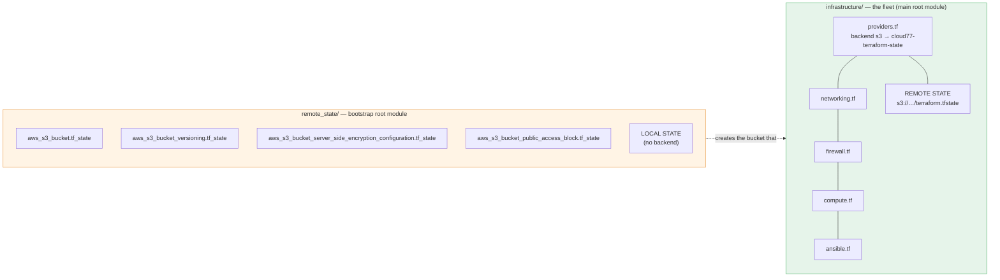
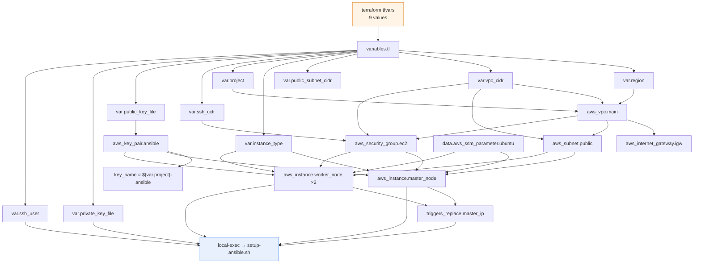

# Architecture

Design rationale for every resource in the stack, why the boundaries fall where they do,
and — just as importantly — what was deliberately left out.

- [Design goals](#design-goals)
- [Non-goals](#non-goals)
- [Module topology](#module-topology)
- [Resource-by-resource rationale](#resource-by-resource-rationale)
- [The bootstrap boundary](#the-bootstrap-boundary)
- [Data flow: inputs to resources](#data-flow-inputs-to-resources)
- [Execution graph](#execution-graph)
- [Deliberate omissions](#deliberate-omissions)
- [Failure modes](#failure-modes)
- [Evolution path](#evolution-path)

---

## Design goals

1. **Reproducibility.** A clean checkout plus `terraform.tfvars` should produce a working
   three-node fleet with no console intervention.
2. **Observable intent.** Every resource is named and tagged; every variable has a
   `description`; every output says what it is for.
3. **Honest automation boundaries.** Where automation stops and a human takes over is
   explicit and documented, not incidental.
4. **Cost awareness.** Smallest instance type, no unnecessary always-on managed services.
5. **Reviewability.** A stranger should be able to read one file per concern and form an
   accurate mental model.

## Non-goals

This is a reference implementation and a demonstration of two bootstrap paradigms. It is
explicitly **not**:

- a production deployment (no immutable AMI pipeline, no patch management, no golden image);
- highly available (single AZ, single subnet, no load balancer, no auto-recovery);
- cost-optimised at scale (per-node public IPs and no NAT are fine at n=3, wrong at n=30);
- audited for compliance (no evidence pipeline, no hardened images, no CIS benchmark);
- network-segmented (flat, single-tier by design — see [Deliberate omissions](#deliberate-omissions)).

---

## Module topology

Two **independent root modules**, not a parent/child module pair. This is forced by the
bootstrap paradox: the state bucket must exist before any module can use it as a backend,
so the module that creates the bucket cannot itself use that bucket.



**Consequences of this topology**

- The main root module lives in `infrastructure/`. Every command below is written from the
  repository root as `terraform -chdir=infrastructure …`; `terraform fmt -recursive` and
  `make check` work from the root because both modules are covered by the same recursion.
- The two modules have independent lifecycles and independent state. `terraform destroy`
  in the main module **will not** delete the state bucket — good, since destroying the
  bucket while it is your backend corrupts your own state.
- The bucket name is hard-coded twice: as a literal in `infrastructure/providers.tf` and as
  a literal in `remote_state/main.tf`. They agree today because both were typed as
  `cloud77-terraform-state`. Change one without the other and `terraform init` fails with a
  missing-bucket error. There is no variable wiring them together because a `backend` block
  cannot reference `var.*` — see [KI-10](KNOWN-ISSUES.md#ki-10).
- Deleting the bucket requires an explicit, separate `terraform destroy` in
  `remote_state/`. See [DEPLOYMENT.md § Full teardown](DEPLOYMENT.md#full-teardown).

---

## Resource-by-resource rationale

### `providers.tf` — backend and provider

```hcl
backend "s3" {
  bucket       = "cloud77-terraform-state"
  key          = "terraform.tfstate"
  region       = "eu-north-1"
  use_lockfile = true
  encrypt      = true
}
```

| Setting | Why |
|---|---|
| `encrypt = true` | SSE-S3 on the state object. State contains instance IDs, public IPs and the `ssh_cidr` value, so it is sensitive even though no credentials are stored in it. |
| `use_lockfile = true` | S3-native conditional-write locking (Terraform ≥ 1.10). Avoids provisioning and paying for a DynamoDB lock table, which is the pre-1.10 convention and still the most common tutorial. **This is the setting that makes `required_version` wrong — see [KI-01](KNOWN-ISSUES.md#ki-01).** |
| Single flat `key` | No workspace-per-environment layout. `workspace_key_prefix` is unset, so the default `env:` prefix applies only if you use `terraform workspace`. Consider `key = "env/prod/terraform.tfstate"` before promoting this pattern. |
| No `kms_key_id` | SSE-S3 (AES-256) is sufficient for most threat models. A customer-managed CMK adds auditability and key-rotation control at the cost of a key to manage. |

Two notable absences: there is no `default_tags` block, so tags are set per-resource by
hand; and there is no `profile`/`assume_role`, so authentication is entirely ambient.

### `networking.tf` — VPC skeleton

```hcl
data "aws_availability_zones" "available" { state = "available" }
```

**Why one AZ.** The brief is a three-node lab. Multi-AZ would mean subnets per AZ and a
choice of which AZ to place instances in. The consequence is that the fleet cannot survive
an AZ failure and Terraform will not spread instances for you.

**Why `names[0]` is a latent hazard.** The AWS provider returns availability zone names
in an order that is *not* guaranteed stable across regions or API versions. `names[0]`
resolved to one AZ during development; a future `terraform init`/provider upgrade could
resolve to a different one and **replace the subnet**, cascading into instance
replacement. Sorting the list makes the choice deterministic. See
[KI-15](KNOWN-ISSUES.md#ki-15).

**Route table.** The default route is declared as an **inline `route` block** rather than a
separate `aws_route` resource. This is the modern style and avoids managing a
route-table-association race. It also means the table has exactly one route and cannot be
extended declaratively without editing the block — fine at this size.

**No private subnet, no NAT gateway.** Every node is internet-reachable and reaches the
internet through the IGW directly. This removes a NAT gateway (≈ $32/mo plus per-GB data
charges) and a second subnet, at the cost of eliminating network segmentation. The
Docker install genuinely needs outbound HTTPS to `download.docker.com`, so outbound
access is a hard requirement, not a convenience.

**`enable_dns_hostnames = true`** but `enable_dns_support` is not set. DNS support is on by
default for new VPCs, so this is consistent — but stating it explicitly is better practice.

### `firewall.tf` — security group and key pair

| Rule | Direction | Port | Source | Purpose |
|---|---|---|---|---|
| `SSH from admin IP` | ingress | 22 | `var.ssh_cidr` | Operator → master. Also permits operator → workers (shared SG). |
| `SSH between nodes inside the VPC` | ingress | 22 | `var.vpc_cidr` | Master → workers over private IPs. |
| `HTTP from admin IP` | ingress | 80 | `var.ssh_cidr` | Operator → worker nginx. |
| `HTTP inside the VPC` | ingress | 80 | `var.vpc_cidr` | In-VPC consumers → worker nginx. |
| (unnamed) | egress | all | `0.0.0.0/0` | Package downloads, Docker repo, image pulls. |

Port 80 is reached by the nginx container the Stage 3 playbook starts. It was unreachable
before [KI-18](KNOWN-ISSUES.md#ki-18) was fixed — the playbook published `0.0.0.0:80` but no
ingress rule permitted it, so the container served nothing reachable from off-host.

**Why the intra-VPC rule uses `vpc_cidr`.** It is the simplest correct expression of "any
node in this VPC may SSH to any node." A more precise version would source
`aws_security_group.ec2.id` itself (self-referencing), which is the standard way to say
"only this group." Because all three nodes share one group, the two are equivalent today —
but self-reference is what you want the moment you split roles into separate groups.

**Why the admin `/32` rule also covers workers.** Both instances attach the same SG, so the
restriction cannot be asymmetric with the current topology. Operators are expected to reach
workers *through* the master, but nothing technically prevents a direct SSH. If that matters,
the master and workers need separate SGs — see [Evolution path](#evolution-path).

**Key pair.** `key_name = "${var.project}-ansible"` — previously hard-coded to
`terraform-ansible`, which collided across projects in one account
([KI-03](KNOWN-ISSUES.md#ki-03)). Terraform uploads only the *public* key; the private key
never leaves the operator's machine except via the deliberate `scp` in Stage 2.

### `compute.tf` — instances

```hcl
data "aws_ssm_parameter" "ubuntu" {
  name = "/aws/service/canonical/ubuntu/server/24.04/stable/current/amd64/hvm/ebs-gp3/ami-id"
}
```

**Why the SSM parameter instead of an AMI ID.** Canonical publishes the current Ubuntu AMI
ID per region to SSM. Referencing it means the configuration works in any region without a
lookup table, and it is the officially supported mechanism for "always give me the latest
24.04."

**The cost of that choice** is reproducibility. `stable/current` is a moving target: a
`terraform refresh` weeks later can resolve to a newer AMI, producing a plan that replaces
instances. For a lab that is desirable. For anything you intend to rely on, pin the AMI ID
or its digest. See [KI-07](KNOWN-ISSUES.md#ki-07).

**Why no `root_block_device`.** The AMI's default 8 GiB `gp3` volume is adequate and
unencrypted-by-default is the EBS default. Explicitly setting
`encrypted = true` and `volume_type = "gp3"` documents intent even when it matches the
default — worth doing in production, see [KI-14](KNOWN-ISSUES.md#ki-14) for the adjacent
IMDS finding.

**Why no `user_data`.** This is the central design choice. A `user_data` bootstrap would be
more Terraform-native, but Terraform can only observe that it was *attached*, never that it
*succeeded*. A failure inside cloud-init surfaces as an instance that exists and is
unreachable, with a green `terraform apply`. Moving the same work into a `local-exec`
provisioner makes it part of the apply graph: if the script exits non-zero, the apply
fails and the operator knows immediately.

**Why the master has no `count`.** The master is a single resource, not a counted one. This
keeps `aws_instance.master_node.public_ip` a scalar reference instead of `[*][0]`, which
keeps `outputs.tf` and `ansible.tf` readable. Workers use `count = 2` because they are
genuinely interchangeable.

**Worker naming.** `count.index + 1` produces `Cloud7-Worker-Server1` and
`Cloud7-Worker-Server2`. Note this is `count.index`, not `instance_id` — reordering or
inserting into the count will reassign names to different physical instances.

**No `lifecycle` blocks.** Without `create_before_destroy`, changing `instance_type`
destroys the old node before creating the new one — a full outage, and worse here, because
the bootstrap script's private-key copy on the old master disappears with it. See
[KI-16](KNOWN-ISSUES.md#ki-16).

### `ansible.tf` — the provisioning trigger

```hcl
resource "terraform_data" "ansible_setup" {
  triggers_replace = {
    master_ip  = aws_instance.master_node.public_ip
    worker_ips = join(",", aws_instance.worker_node[*].private_ip)
    script     = filesha256("${path.module}/setup-ansible.sh")
    playbook   = filesha256("${path.module}/docker.yml")
  }
  provisioner "local-exec" { ... }
}
```

**Why `terraform_data` rather than a provisioner on the instance.** `aws_instance` supports
`connection`/`remote-exec`, but this work runs on the *operator's* machine: it reads a local
private key, runs local `bash`, and needs `scp`. `local-exec` is the correct provisioner
type, and `terraform_data` is the modern way to attach a bare `local-exec` to something in
the graph without bolting it onto an unrelated resource.

**Why `triggers_replace` is the right idempotency key.** The script is *not* idempotent, so
the design deliberately does not pretend it is. Instead it re-runs exactly when something it
depends on has changed:

| Trigger | Re-runs when | Correct behaviour? |
|---|---|---|
| `master_ip` | Master is replaced, or its public IP is reassigned | ✅ Yes |
| `worker_ips` | Any worker is replaced (new private IPs) | ✅ Yes — inventory must be rewritten |
| `script` | `setup-ansible.sh` is edited | ✅ Yes — the whole point of `filesha256` |
| `playbook` | `docker.yml` is edited | ✅ Yes — the script `cp`s it to the master, so a stale copy would otherwise persist |
| `requirements` | `requirements.yml` is edited | ✅ Yes — the collection install runs remotely from that file, so a stale copy would silently pin the wrong version |

What it does **not** cover: changes to `ssh_user` (the script is not re-run, though a master
replacement re-triggers via `master_ip`), or anything outside `docker.yml` that affects the
playbook's result.

Note that `playbook` only re-runs **Stage 2**. It re-copies the playbook to the master; it
does not apply the playbook. Stage 3 is still a manual `ansible-playbook docker.yml` on the
master, which is the point of the two-tool design.

**What the provisioner actually runs:**

```bash
bash ./setup-ansible.sh \
  -m <master_public_ip> \
  -u ubuntu \
  -K <base64("C:/Users/…/.ssh/id_ed25519")> \
  <worker_private_ip_1> <worker_private_ip_2>
```

Three details worth explaining:

1. **`working_dir = path.module`** makes `./setup-ansible.sh` resolve regardless of where
   Terraform was invoked from.
2. **The `-K` base64 flag is a Windows workaround.** `local-exec` on Windows cannot export
   environment variables to the child process, so passing the key path via `$env:` or an
   exported variable silently produces an empty value. Base64-encoding the path into an
   argument sidesteps the shell entirely. It is obfuscation, not encryption — and it means
   the key path lands in the plan output and the apply log. See
   [SECURITY.md](SECURITY.md#s3--the-private-key-is-copied-to-the-control-node-and-left-there).
3. **Worker IPs passed positionally** after the flags. The script collects them with
   `shift $((OPTIND - 1))`. Fragile in the sense that a stray positional argument is
   silently treated as a worker; robust in that it needs no environment plumbing.

---

## The bootstrap boundary

The most important architectural idea in this repository.

```mermaid
graph LR
    subgraph T["Terraform knows about"]
        T1["Instances exist"]
        T2["Security groups exist"]
        T3["Key pair registered"]
        T4["✔ verifiable via API"]
    end
    subgraph B["setup-ansible.sh knows about"]
        B1["SSH works"]
        B2["Ansible installed"]
        B3["Inventory written"]
        B4["✔ verifiable via exit code"]
    end
    subgraph A["docker.yml knows about"]
        A1["Docker installed"]
        A2["docker group membership"]
        A3["Service enabled at boot"]
        A4["✔ verifiable via ansible all -m ping / idempotency"]
    end

    T -->|"exit code gates apply"| B -->|"operator runs it"| A

    style T fill:#e8f0fe,stroke:#4285f4
    style B fill:#fff4e5,stroke:#e69138
    style A fill:#e6f4ea,stroke:#34a853
```



**The rule being demonstrated:** each stage should only be responsible for things the
*previous* stage's tooling can verify.

- Terraform cannot verify that cloud-init succeeded → so it delegates OS work outward.
- Bash cannot verify convergence, only that commands exited 0 → so it stops once Ansible
  exists and hands over.
- Ansible *can* verify convergence, because a second run reports `ok` instead of `changed`.
  It is therefore the right tool for the final stage, and running it twice is a legitimate
  test.

**The cost of the boundary.** Configuration truth is still split between `variables.tf` and
`docker.yml`, with `setup-ansible.sh` templating `ansible.cfg` and the inventory in heredocs.
There is no schema validation across them and no single place to look. The project accepts
this — it is inherent to a two-tool bootstrap. The playbook duplication that used to make
this actively dangerous is fixed ([KI-12](KNOWN-ISSUES.md#ki-12)): `setup-ansible.sh` now
`cp`s the tracked `docker.yml`, and `filesha256(docker.yml)` is a replace trigger, so there is
exactly one copy in the repository.

---

## Data flow: inputs to resources



Note the flow direction that trips people up: **`private_key_file` never reaches an AWS
resource.** It only flows into the `local-exec` command line. Terraform reads the *public*
key from disk and uploads it; the private key is used exclusively by the operator's own SSH
client.

---

## Execution graph

Resource creation order as Terraform resolves dependencies:

```text
 1. data.aws_availability_zones.available     (read-only)
 2. data.aws_ssm_parameter.ubuntu              (read-only, per region)
 3. aws_vpc.main
 4. aws_internet_gateway.igw                   ← depends on VPC
 5. aws_subnet.public                          ← depends on VPC + AZ data
 6. aws_route_table.public                     ← depends on VPC + IGW
 7. aws_route_table_association.public        ← depends on subnet + route table
 8. aws_security_group.ec2                     ← depends on VPC
 9. aws_key_pair.ansible                       (independent)
10. aws_instance.master_node                   ← depends on 2,5,8,9
11. aws_instance.worker_node[0]                ← depends on 2,5,8,9
12. aws_instance.worker_node[1]                ← depends on 2,5,8,9
13. terraform_data.ansible_setup               ← depends on 10,11,12 + local file
```

Steps 10–12 are created **in parallel** by default, which is why the script's SSH wait loop
exists: instance 13's provisioner can begin before `cloud-init` on the master has released
port 22.

`terraform destroy` runs the reverse graph. The key pair and the security group are deleted
last, after the instances that reference them.

---

## Deliberate omissions

Everything in this table is absent on purpose at n=3. Each entry states what would make it
necessary.

| Omitted | Why it is absent | Add it when |
|---|---|---|
| Private subnets + NAT gateway | +$32/mo and a second subnet for no benefit at n=3 | Nodes need outbound internet but no inbound, or you need segmentation |
| Bastion host / Session Manager | The operator's IP is the only SSH source today | You need an access path that survives IP changes |
| IAM roles / instance profile | Nothing on the nodes calls AWS APIs | You attach workloads that need S3/SQS/SSM access |
| IMDSv2 enforcement | No workload uses the metadata service | Any untrusted process runs on a node — [KI-14](KNOWN-ISSUES.md#ki-14) |
| VPC Flow Logs | No investigation requirement | You need network forensics |
| CloudTrail | Account-level, not stack-level | Compliance or audit requirements |
| `default_tags` in the provider | Tags are set per resource | You have more than a handful of resources and want `Owner`/`Env` everywhere |
| CloudWatch alarms | No SLO to alert on | You need to be paged |
| Bastion/`Session Manager` | as above | as above |
| Multi-AZ | n=3 lab | Availability requirements — [KI-15](KNOWN-ISSUES.md#ki-15) |
| AMI baking (Packer) | Ubuntu Cloud Images are already hardened and patched | You need a golden image with your own software |
| `prevent_destroy` lifecycle | Teardown should be easy | Production state you cannot afford to lose |
| S3 lifecycle policy on state | Keeping every version is the safe default | State version count becomes a cost or compliance problem |

Note the AWS account's **default security group** is untouched by Terraform, as expected —
Terraform only manages resources it declares. If you have ever modified it manually, that
drift will not appear in `terraform plan`.

---

## Failure modes

| Failure | Where it surfaces | Recovery |
|---|---|---|
| State bucket missing or misnamed | `terraform init` | Create it via `remote_state/`, or correct the literal in `providers.tf` |
| SSH key not found at `public_key_file` | `terraform plan` (`file()` fails) | Generate the keypair; check the `~` expansion |
| SSH key permissions too open locally | `setup-ansible.sh` step 1 (`ssh-keygen -y` fails) | `chmod 600` — the script already mitigates this by working on a copy |
| `ssh_cidr` does not match the operator's current IP | `terraform apply` succeeds, then `setup-ansible.sh` step 2 times out after ~300 s | Update `ssh_cidr`, `terraform apply`, retry |
| AMI SSM parameter missing in region | `terraform plan` | Verify Canonical publishes that path in your region |
| `local-exec` fails mid-bootstrap | `terraform apply` exits non-zero **after** instances exist | Fix the cause and re-run `terraform apply` — the instances are in state, so only the provisioner re-runs |
| Worker replaced, inventory stale | `ansible all -m ping` fails on one host | `terraform apply` re-runs the script via `triggers_replace`; or re-run it manually |
| Playbook edited in the repo | `terraform_data.ansible_setup` is replaced by the `playbook` trigger and the script re-copies `docker.yml` to the master | Nothing to do — this used to fail silently. The playbook itself still has to be run on the master. |
| Two operators applying concurrently | One blocks on the S3 lockfile, then proceeds | Expected. `use_lockfile` is doing its job. |
| AZ ordering changes across provider versions | `terraform plan` proposes replacing the subnet | See [KI-15](KNOWN-ISSUES.md#ki-15) |

---

## Evolution path

If this were taken toward production, the order I would change things is below. Each step
is independently valuable, and the sequence is roughly increasing cost and complexity.

1. **Correctness.** Fix [KI-01](KNOWN-ISSUES.md#ki-01) (version constraint) and [KI-10](KNOWN-ISSUES.md#ki-10) (bucket collision). Both are cheap and remove real classes of failure. [KI-02](KNOWN-ISSUES.md#ki-02) and [KI-12](KNOWN-ISSUES.md#ki-12) are already fixed here.
2. **Determinism.** Sort AZs, pin the AMI, add `default_tags`, add `lifecycle` guards.
3. **Segmentation.** Split into public and private subnets with a NAT gateway; move workers
   to private subnets with no public IPs; add a bastion or Session Manager. This is the
   change that most improves the security posture.
4. **Identity.** Split the shared security group into per-role groups using self-references;
   add an instance profile with least-privilege permissions; enforce IMDSv2.
5. **State hygiene.** Per-environment state keys, a customer-managed CMK, a lifecycle policy
   on state versions, and `prevent_destroy` on the bucket.
6. **Observability.** VPC Flow Logs, CloudTrail, CloudWatch alarms on the Docker service,
   and `ansible.posix.at` scheduled health checks.
7. **Image pipeline.** Bake the Docker toolchain into a Packer AMI so Stage 3 shrinks to
   configuration only.
8. **Bootstrap consolidation.** Once a golden AMI exists, `user_data` or SSM Document
   execution becomes viable again, and the Bash stage can shrink to inventory generation
   only.

Steps 1 and 2 are cheap enough to do immediately and would resolve every issue currently
rated Medium or High in [KNOWN-ISSUES.md](KNOWN-ISSUES.md).

---

## Further reading

- [DEPLOYMENT.md](DEPLOYMENT.md) — the commands, in order, with expected output
- [OPERATIONS.md](OPERATIONS.md) — day-two tasks, scaling, teardown
- [SECURITY.md](SECURITY.md) — threat model and findings
- [KNOWN-ISSUES.md](KNOWN-ISSUES.md) — defects with patches
- [../README.md](../README.md) — project overview and quick start
