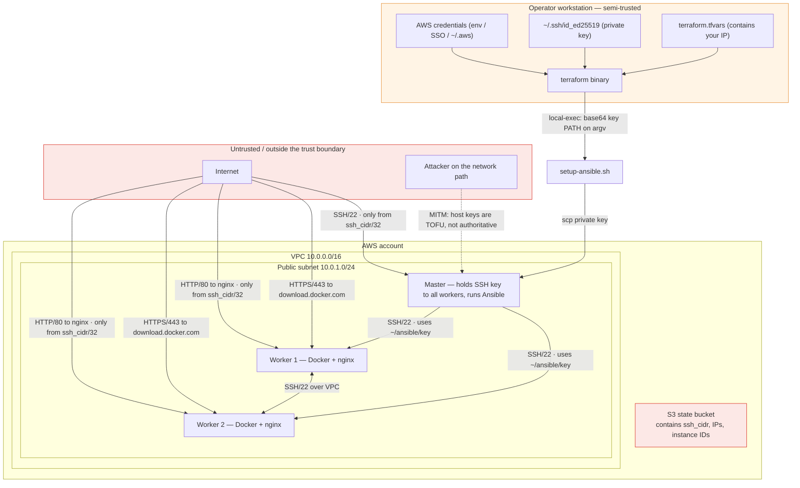

# Security Assessment

Threat model, findings and remediation plan for the EC2 fleet. Written to be
disagreed with: every severity rating below is an argument, not a fact, and the
reasoning is shown so a reviewer can reach a different conclusion.

- [Scope and assumptions](#scope-and-assumptions)
- [Trust boundaries](#trust-boundaries)
- [Assets](#assets)
- [Threat actors](#threat-actors)
- [Findings summary](#findings-summary)
- [Findings in detail](#findings-in-detail)
- [What is done well](#what-is-done-well)
- [Remediation plan](#remediation-plan)
- [Pre-publication hygiene](#pre-publication-hygiene)
- [Verification commands](#verification-commands)

---

## Scope and assumptions

**In scope:** the two Terraform root modules, `setup-ansible.sh`, `docker.yml`, and the
AWS resources they create.

**Out of scope:** the AWS account around this stack (MFA, root user, other workloads),
the operator's workstation, IAM policy design beyond what the stack calls, and the
Canonical Ubuntu base image.

**Assumptions:**

| # | Assumption | If false |
|---|---|---|
| A1 | A single operator holds AWS credentials with broad EC2 permissions | Findings about credential scope are wrong |
| A2 | `ssh_cidr` is a real single-operator `/32` | S3 is the primary ingress, not SSH |
| A3 | The stack runs in a personal or training AWS account, not production | Many Medium findings become High |
| A4 | No untrusted code runs on the nodes | S4 becomes Critical |
| A5 | The state bucket is private and the account has one tenant | Cross-tenant leakage becomes possible |
| A6 | Snapshots and AMIs are not shared outside the account | Lower |

> **Read this first.** Under A3 the overall risk is **Medium**. Promote every finding one
> level if this is production or if A4 is false. The findings are deliberately not
> downgraded to "lab appropriate" — several of them are cheap to fix and should be.

---

## Trust boundaries



**The two boundaries that matter most**

1. **Internet → control node.** The only authenticated path into the fleet. Protected by a
   `/32` firewall rule and by SSH key authentication.
2. **Control node → workers.** Protected by possession of the private key copied to
   `~/ansible/key`. Host keys are TOFU-verified, not authoritative; there is no bastion and
   no segmentation. Compromise of the master is compromise of both workers.

Note that the operator's `/32` SSH rule applies to the shared security group, so operator →
worker SSH is also open — see [S4](#s4--no-lateral-movement-containment).

---

## Assets

| Asset | Where | Impact if lost |
|---|---|---|
| SSH private key | Operator machine, `~/ansible/key` on master | Full fleet compromise if the master's copy leaks |
| AWS credentials | Operator environment | Full account compromise |
| Terraform state | S3 bucket | Infrastructure topology, IPs, `ssh_cidr`; enables targeted attack |
| `ssh_cidr` | `terraform.tfvars` → state | Attacker learns the operator's IP, or their range |
| Docker on workers | Worker filesystem | Container-escape-to-host if untrusted images run |
| The fleet itself | AWS | ≈ $42/month and a foothold in the VPC |

---

## Threat actors

| Actor | Capability | Motivation |
|---|---|---|
| **T1 Internet background scanner** | Automated, no credentials | Mass exploitation of known CVEs, credential stuffing |
| **T2 Network MITM** | Position on the path (rogue Wi-Fi, ARP/DNS on a LAN, hostile ISP) | Intercept the SSH session and the private key pushed to the master |
| **T3 Credential thief** | Malware on the operator workstation | Keys and AWS tokens |
| **T4 Malicious container image** | Publishes a popular-but-compromised image | Code execution on the worker, then lateral movement |
| **T5 Over-privileged insider** | Legitimate AWS access | Data access, resource abuse, cover for exfiltration |

---

## Findings summary

Severity is **impact × likelihood** for this specific topology.

| ID | Finding | Severity | CVSS-ish | Fix effort | Status |
|---|---|---|---|---|---|
| S1 | SSH host-key verification is TOFU, not authoritative | **Medium** | 6.4 | Medium | Partially fixed — `accept-new` |
| S2 | Unrestricted egress from all nodes | **Medium** | 6.5 | Low | Open |
| S3 | Private key copied to the control node and persisted — valid against **all three** nodes, reachable from your `/32` | **High** | 7.1 | Medium | Open (by design) — scope documented, [KI-19](KNOWN-ISSUES.md#ki-19) |
| S4 | No lateral-movement containment (flat network, shared SG, shared key) | **Medium** | 6.5 | High | Open |
| S5 | IMDSv1 not enforced | **Medium** | 6.2 | Low | Open |
| S6 | Key pair name predictable | **Low** | 3.7 | Trivial | Fixed — `${var.project}-ansible` |
| S7 | `ssh_cidr` and state committed to git | **High** (pre-publication) | 7.5 | Trivial | Fixed — `.gitignore` |
| S8 | Base64-obfuscated key path on the command line | **Low** | 2.4 | Low | Open |
| S9 | Single shared security group for all roles | **Medium** | 5.3 | Medium | Accepted — [KI-19](KNOWN-ISSUES.md#ki-19) |
| S10 | No VPC Flow Logs or CloudTrail evidence | **Low** | 3.0 | Low | Open |
| S11 | Single `/32` SSH source, no bastion or Session Manager | **Medium** (availability) | 5.0 | Medium | Open |
| S12 | Docker socket access is equivalent to root | **Informational** | — | Document | Mitigated — no `docker` group task |
| S13 | EBS volumes not explicitly encrypted | **Low** | 3.3 | Trivial | Open |
| S14 | No MFA / role assumption enforced by the stack | **Low** | 3.5 | Low | Open |
| S15 | Unpinned apt packages from the Docker repo | **Low** | 3.7 | Medium | Open |

---

## Findings in detail

### S1 — SSH host-key verification is TOFU, not authoritative

**Severity: High → Medium after the fix** · **Where:** `setup-ansible.sh`, generated `ansible.cfg`

**Status: partially fixed in this repository** ([KI-08](KNOWN-ISSUES.md#ki-08)).

The original script used:

```bash
SSH_OPTS=(-o StrictHostKeyChecking=no -o UserKnownHostsFile=/dev/null
          -o IdentitiesOnly=yes -o ConnectTimeout=10 -o LogLevel=ERROR
          -i "$KEY_FILE")
```

and, on the master, in the generated `ansible.cfg`:

```ini
host_key_checking = False
```

Both paths now use `accept-new` instead, which records a key on first contact and refuses a
*changed* key afterwards:

```bash
SSH_OPTS=(-o StrictHostKeyChecking=accept-new -o IdentitiesOnly=yes
          -o ConnectTimeout=10 -o LogLevel=ERROR -i "$KEY_FILE")
```

```ini
ssh_args = -o ControlMaster=auto -o ControlPersist=60s -o StrictHostKeyChecking=accept-new
host_key_checking = False
ssh_known_hosts_check = False
```

> `host_key_checking` and `ssh_known_hosts_check` are both `False` on purpose. Ansible's
> `host_key_checking = True` would append `StrictHostKeyChecking=yes` to `ssh_args` and
> override the `accept-new` we just set, which would make the bootstrap hang on a fresh
> instance. Setting them to `False` stops the override while leaving `accept-new` intact.

**Why it is still not fully closed.** TOFU has a first-connection window on every host: the
first key presented at an address is accepted without question. Workers get new private IPs
on every replacement, so that window reopens each time. Closing it needs host keys
distributed out of band — for example written into `known_hosts` by `setup-ansible.sh` from a
`describe_instances` call — which is a bigger change than this one.

**What was wrong originally.** `StrictHostKeyChecking=no` with `UserKnownHostsFile=/dev/null` means the
client accepts *any* host key for *any* host, every time, and records nothing. The
connection is encrypted but **unauthenticated** — the same protection model as an
unencrypted HTTP request wrapped in TLS without certificate validation.

Every SSH session this stack creates is therefore vulnerable to T2. Two of them matter
most:

1. **The initial session to the master.** The script fetches the master IP from Terraform
   and connects. An attacker who can answer for that IP receives the operator's SSH
   authentication attempt. Combined with S3, an attacker who can *write* to the state bucket
   can substitute their own IP and receive a full authentication attempt.
2. **Every master → worker session.** Ansible connects to both workers with host checking
   off. An attacker on the VPC network path between master and worker receives the key's
   authentication.

**Why it is there.** Legitimate reasons, all of which are better solved another way:

- *Instances get new IPs on every replacement, so the host keys keep changing.* Correct —
  but that is what host key *rotation* is for, not verification.
- *Avoiding interactive prompts on a fresh cloud-init instance.* Correct — use
  `-o StrictHostKeyChecking=accept-new`, which TOFU-verifies: it records a key the first
  time and refuses a *changed* key thereafter.
- *Worker IPs come from Terraform output.* That the address is authoritative says nothing
  about the key presented by the host at it.

**Impact.** Credential theft on the SSH path, or transparent interception and modification of
the Ansible stream — including the moment `setup-ansible.sh` `scp`s the private key to the
master.

**Full remediation**, beyond what is applied: distribute host keys from Terraform as a
`known_hosts` file so verification is authoritative rather than TOFU.

**Residual risk today.** Low for the bootstrap path, Medium overall — TOFU still has a
narrow first-connection window on each worker, and workers are replaced regularly.

---

### S2 — Unrestricted egress from every node

**Severity: Medium** · **Where:** `firewall.tf:23-28`

```hcl
egress {
  from_port   = 0
  to_port     = 0
  protocol    = "-1"
  cidr_blocks = ["0.0.0.0/0"]
}
```

**What is wrong.** Every node can reach any destination on any port, forever. There is no
egress filtering, inspection, or logging.

**Why it matters here specifically.** The workers run Docker. A container that escapes, or a
compromised image pulled from a registry, has unrestricted outbound access for
exfiltration, C2 callback, and credential theft against any reachable service — including
the AWS EC2 instance metadata endpoint at `169.254.169.254`. Combined with S5, that is a
complete initial-access path.

**Remediation.** Layered, cheapest first:

1. **Immediate, cheap:** deny metadata at the network layer.
   ```hcl
   egress {
    description = "Deny IMDS"
    from_port   = 80
    to_port     = 80
    protocol    = "tcp"
    cidr_blocks = ["169.254.169.254/32"]
   }
   ```
   (AWS SG semantics: an `egress` block with no matching rule for a destination denies it,
   so *omitting* the blanket rule is what actually denies IMDS — add the block above only if
   you also keep the blanket rule for defence in depth via a NACL.)
2. **Better:** drop the blanket rule and allowlist what is needed — `0.0.0.0/0:443` for the
   Docker apt repo and registry pulls, `0.0.0.0/0:80` for `archive.ubuntu.com` and
   `security.ubuntu.com` updates, plus DNS to the VPC resolver and NTP to `169.254.169.123`.
3. **Best:** VPC endpoints (`com.amazonaws.<region>.s3`) and a proxy for the rest, so
   outbound traffic is inspectable and loggable.

**Caveat.** Steps 2 and 3 will break the Docker install if you forget the DNS and NTP rules.
Both `apt` and `docker pull` fail in confusing ways without them.

---

### S3 — The private key is copied to the control node and left there

**Severity: High** · **Where:** `setup-ansible.sh:150-158, 225-231`, `compute.tf`, `firewall.tf`

```bash
cp "$KEY_FILE" "$LOCAL_TMP/key"   # local copy, cleaned up by the EXIT trap
"${scp_cmd[@]}" "$LOCAL_TMP/key" "$SSH_USER@$MASTER_IP:$REMOTE_DIR/key"
"${ssh_cmd[@]}" "chmod 600 '$REMOTE_DIR/key'"
```

**What is right.** The local copy is handled well: `mktemp -d`, `chmod 700` on the
directory, `chmod 600` on the key, validated with `ssh-keygen -y`, and removed by an `EXIT`
trap. The original is never modified. This is better than most implementations.

#### The exact scope of that key — read this before judging the severity

It is easy to assume this is a VPC-internal, master→workers-only credential. **It is not,
and it is not limited to the workers.** Three facts combine:

1. **It is the operator's own key, not a purpose-built one.** `aws_key_pair.ansible` holds
   the same public key for the master *and* both workers (`compute.tf:11,22`). The file on
   the master is a byte-for-byte copy of the key the operator uses from their laptop.
2. **All three instances share one security group** (`compute.tf:10,21`), and that SG admits
   port 22 from `var.ssh_cidr` — the operator's public `/32`. So the workers are directly
   SSH-reachable from the internet too, not only from inside the VPC.
3. Therefore a stolen copy is valid against **every node in the fleet**, and it is usable
   from anywhere the operator's IP is allowed, not only from the VPC. Inside the VPC the
   master can reach the workers regardless, via the `vpc_cidr` rule.

**Blast radius: all three nodes. Master compromise = fleet compromise.** Stolen-from-the-
master key = fleet compromise, and it is not confined to the VPC.

**What is wrong.** The copy on the master **persists** at `~/ansible/key` for the life of the
instance. Anyone who obtains shell on the master — via S1, a compromised Ansible Galaxy
collection, or an operator mistake — holds that credential. The same is true in reverse: any
process on the master that can read `~/ansible/key` (anything running as `ubuntu`, including
a malicious collection installed by `ansible-galaxy` in step 4/6) exfiltrates fleet-wide SSH
access rather than a single node.

**Why it is there.** It is the standard push-based Ansible model and it is the reason the
master needs no AWS credentials of its own. The alternative is to have each worker fetch
the key, which just moves the problem.

**What is *not* a problem with it**, for completeness: `~/ansible` is `chmod 700` and the
key `chmod 600`, so no other local user can read it; `ansible_ssh_private_key_file` is set
only under `[workers:vars]`, so it is never offered as a credential for the master itself;
and Ansible logs the key *path* (`-i /home/ubuntu/ansible/key`) even at `-vvv`, never key
material, so `~/ansible/ansible.log` is not a leak. `chmod 400` would also be accepted by
OpenSSH and is marginally tighter, but both `400` and `600` deny group and other, so the
difference is cosmetic — `600` is kept because it is the conventional value and leaves the
owner able to rewrite the file.

**Impact.** Master compromise becomes fleet compromise. No lateral-movement containment.

**Remediation, in order of preference.**

1. **Split the security group by role.** Workers admit port 22 from `vpc_cidr` only; the
   master keeps `ssh_cidr` + `vpc_cidr`. This is the cheapest high-value change: an
   in-place SG update, no instance replacement, and it removes the workers from the
   internet entirely on SSH. See [S9](#s9--one-shared-security-group-for-all-roles).
2. **Narrow the key's authority.** Use a *different* key for master → worker SSH than for
   operator → master, so operator-key theft does not grant lateral movement. Requires
   injecting the second public key into the workers (`ansible.posix.authorized_key` using
   the `ssh_public_key` variable the script already generates but never uses — see
   [KI-13](KNOWN-ISSUES.md#ki-13)).
3. **Keep only public key + SSM.** Have the master use
   `ansible.builtin.aws_ssm` with an instance profile to push commands to workers over the
   AWS API. Removes the key copy entirely at the cost of an IAM role.
4. **Shorten the exposure.** Remove the key from the master once the playbook has run, and
   have the operator re-push it when needed. Operationally awkward, and it means no
   unattended runs. See [OPERATIONS.md § Removing the bootstrap key from the master](OPERATIONS.md#removing-the-bootstrap-key-from-the-master).
5. **Use a bastion with agent forwarding.** The master then never holds the key — but see
   S3's note in the remediation table of [KNOWN-ISSUES](KNOWN-ISSUES.md) about why this
   conflicts with the manual Stage 3 step.

**Status in this repository.** Accepted and documented rather than fixed. The shared
security group (remediation 1) and the rotation procedure are known gaps tracked as
[KI-19](KNOWN-ISSUES.md#ki-19); see also [KI-20](KNOWN-ISSUES.md#ki-20).

---

### S4 — No lateral-movement containment

**Severity: Medium** · **Where:** `networking.tf`, `firewall.tf`, `compute.tf`

**What is wrong.** Three properties combine into zero containment:

1. All three nodes are in **one subnet** with **one shared security group**.
2. The SG permits SSH from the **entire VPC CIDR**, so any node can reach any node.
3. All nodes hold **the same key**, so authentication to any node unlocks all of them.

There is no network segmentation, no per-role policy, and no credential scoping. Compromise
of any single node is compromise of the fleet.

**Impact.** The blast radius of any single-node compromise — S1, T4, a vulnerable container
— is the entire fleet.

**Remediation.** Two changes, in order:

```hcl
# 1. Split security groups by role and self-reference for intra-role traffic.
#    "Only instances in THIS group may SSH to each other."
resource "aws_security_group" "worker" {
  name_prefix = "${var.project}-worker-"
  vpc_id      = aws_vpc.main.id

  ingress {
    description     = "SSH from the control node only"
    from_port       = 22
    to_port         = 22
    protocol        = "tcp"
    security_groups = [aws_security_group.master.id]
  }
}

# 2. Give workers no public IP at all — a private subnet with no IGW route,
#    and egress via a NAT gateway. S3 egress from NAT is ~$0.02/GB.
```

Segmentation is the single highest-value change to this design, and the reason is
arithmetic: it converts "compromise of one node" into "compromise of one node". Cost is
roughly +$32/month for the NAT gateway — see [COST.md](COST.md).

---

### S5 — IMDSv1 is not enforced

**Severity: Medium** · **Where:** `compute.tf` (absent `metadata_options`)

**What is wrong.** No `metadata_options` block is set, so instances accept IMDSv1
(unauthenticated, one request per hop) as well as IMDSv2 (token-based, session-oriented).
Any SSRF vulnerability in any process on the node can therefore read instance credentials.

**Why it matters here.** The workers run Docker, whose registry and build tooling has a
history of SSRF-adjacent issues. With S2 unrestricted egress, `169.254.169.254` is
reachable. IMDSv2 removes that path in one line.

**Remediation.**

```hcl
# In both aws_instance resources
metadata_options {
  http_endpoint = "enabled"
  http_tokens   = "required"                    # IMDSv2 only
  http_put_response_hop_limit = 1               # defeat SSRF hop-count tricks
  instance_metadata_tags      = "disabled"
}
```

---

### S6 — Key pair name is predictable

**Severity: Low** · **Where:** `firewall.tf`

**Status: fixed in this repository.**

```hcl
key_name = "terraform-ansible"   # original
```

**What was wrong.** EC2 key pair names are unique per region per account, so a hard-coded
name made two projects in one account collide. The name also advertised the stack's purpose
to anyone enumerating key pairs.

**Fix applied.**

```hcl
key_name = "${var.project}-ansible"
```

The remaining half of the finding is unchanged: the name is still predictable, because
`project` is a human-chosen value. Nothing about key-pair *names* is a secret, so this is
informational rather than a real exposure. Still worth adding `prevent_destroy` plus a
`name_prefix`-based rotation path, because renaming the key pair forces instance
replacement — see [OPERATIONS.md § Rotating the SSH key](OPERATIONS.md#rotating-the-ssh-key).

---

### S7 — `ssh_cidr` and Terraform state must not reach git

**Severity: High (pre-publication)** · **Where:** `terraform.tfvars`, `.gitignore`

**Status: fixed in this repository.** The original `.gitignore` was:

```gitignore
.*
terraform.*
```

- `terraform.*` matched `terraform.tfvars` at any depth ✅
- `.*` matched `.terraform/` ✅
- `.*` **also** matched `.terraform.lock.hcl` — which should be committed
  ([KI-02](KNOWN-ISSUES.md#ki-02))
- `.*` **also** matched `terraform.tfvars.example` via the other pattern — the template
  people are meant to copy never reached them
- `.*` matched *every* dotfile and dot-directory, including `.env`, `.vscode/` and
  `.gitignore` itself. The pattern was too broad to reason about safely.

The current file uses explicit patterns (`.terraform/`, `*.tfvars`, `terraform.tfstate*`,
`*.pem`, `id_rsa*`, `id_ed25519*`, …) and negates `!.terraform.lock.hcl` and
`!terraform.tfvars.example`, so provider versions are now committed for everyone.

**What must be true before the first public commit:**

```bash
# Nothing sensitive is tracked
git ls-files | grep -E 'tfvars|\.tfstate|\.ssh|key' 
# Must print nothing.

# Verify state is ignored
git check-ignore -v terraform.tfvars remote_state/terraform.tfstate
# Both must be ignored.

# Confirm the SSH private key is not in the working tree
find . -name 'id_*' -not -path './.git/*'
# Must print nothing.

# Scan every staged file for your IP
git diff --cached | grep -E '([0-9]{1,3}\.){3}[0-9]{1,3}'
```

**Additionally, before publishing:** review all five files in `screenshots/`. They are
terminal captures of a real deployment and are the most likely place for a public IP,
account ID, instance ID, IAM user name or `$HOME` path to be published. This is the one
item in this document that requires your judgement rather than a command.

---

### S8 — Base64-obfuscated key path on the command line

**Severity: Low** · **Where:** `ansible.tf:13`

```hcl
"-K ${base64encode(pathexpand(var.private_key_file))}",
```

**What is wrong.** Nothing is encrypted — base64 is an encoding. The key *path* is passed
as an argv element because `local-exec` on Windows cannot export environment variables to
the child process.

**Impact.** The path appears in the plan output, the apply log, and CI logs if you ever run
`terraform apply` from CI. It reveals the operator's username and home directory. Not a
key leak, but it is metadata leakage and it looks like a secret-smuggling antipattern to a
reviewer, which invites escalation.

**Remediation.** Pass the path directly and let the script's `resolve_key()` do the work —
it already handles Windows, Git Bash and WSL paths:

```hcl
"-k ${pathexpand(var.private_key_file)}",
```

If environment-variable passing is preferred, set `TF_VAR_private_key_file` and read it
from `terraform output -json`, which is the script's existing fallback path.

---

### S9 — One shared security group for all roles

**Severity: Medium** · **Where:** `firewall.tf`

**What is wrong.** The master and both workers attach the same SG, so every ingress rule
applies to every node. The operator `/32` rule technically permits direct SSH to the workers
as well as the master, and the `vpc_cidr` rule permits any node to reach any node.

**Why this is more than cosmetic.** The `/32` rule is the reason the key on the master is an
internet-reachable, fleet-wide credential rather than a VPC-internal one — see
[S3](#s3--the-private-key-is-copied-to-the-control-node-and-left-there). Splitting the SG is
the single cheapest change that reduces the blast radius of a master compromise, and it is
an in-place update: editing an ingress rule on an attached SG does not force instance
replacement. The cost is that direct operator → worker SSH stops working, which is the
documented intent anyway — the master is meant to be the only entry point.

**Remediation.** Three groups: `master` (operator `/32` inbound), `worker` (SG-reference to
`master` inbound), and a shared `egress` policy. This is the mechanism behind S4's
remediation and is best done together with it.

**Interim mitigation with no code change:** document that direct operator → worker SSH is
not a supported path, and prefer the master as the only entry point. This is now stated
explicitly in [OPERATIONS.md](OPERATIONS.md#day-2-mental-model).

**Status in this repository.** Accepted and documented rather than fixed. Tracked as
[KI-19](KNOWN-ISSUES.md#ki-19).

---

### S10 — No network or API audit trail

**Severity: Low** · **Where:** absent

Nothing in this stack produces evidence of who connected to what, or when. For an account
under T5, there is no way to detect lateral movement after the fact.

**Remediation.**

```hcl
resource "aws_flow_log" "vpc" {
  vpc_id          = aws_vpc.main.id
  traffic_type    = "REJECT"     # rejected flows only — cheap, high signal
  log_destination = aws_cloudwatch_log_group.vpc.name
  iam_role_arn    = aws_iam_role.flow_logs.arn
}

resource "aws_cloudwatch_log_group" "vpc" {
  name              = "/aws/vpc/flowlogs/${var.project}"
  retention_in_days = 14
}

resource "aws_cloudwatch_log_metric_filter" "rejects" {
  name          = "rejected-connections"
  log_group_name = aws_cloudwatch_log_group.vpc.name
  pattern       = "REJECT"
  metric_transformation {
    namespace = "${var.project}/NetworkFlows"
    name      = "RejectedConnections"
    value     = "1"
  }
}
```

`REJECT`-only flow logs are the sweet spot: a few dollars a month and they surface exactly
the traffic that should not be happening. Enable CloudTrail at the account level separately.

---

### S11 — Single `/32` SSH source with no fallback path

**Severity: Medium** (availability) · **Where:** `firewall.tf:5-11`

**What is wrong.** SSH is permitted from exactly one address, and there is no alternative
access path. When the operator's IP changes — new ISP, VPN, tethering, corporate proxy —
the fleet becomes unreachable until `ssh_cidr` is updated and applied.

**Remediation, in preference order.**

1. **SSM Session Manager** — no inbound ports at all, IAM-authenticated, works from a
   browser. Requires an instance profile, so add `aws_iam_instance_profile` with
   `AmazonSSMManagedInstanceCore`. Effectively removes S1, S6 and the `/32` problem at once.
2. **Bastion host** in a public subnet, workers in private subnets. The bastion can be
   replaced on a schedule.
3. **A second known `/32`** for a second network, as an interim measure.

Widening to `0.0.0.0/0` is not a fix — it trades availability for S1 and T1 exposure, and
key-only auth on a `t3.micro` with an internet-wide SSH rule is a well-scanned target.

---

### S12 — Anyone who can reach the Docker socket is root

**Severity: Informational** · **Where:** `docker.yml`

**Status: mitigated in this repository.** The original playbook added `ubuntu` to the
`docker` group:

```yaml
- name: Add users to docker group
  user:
    name: "{{ item }}"
    groups: docker
    append: yes
```

That task is gone. Nothing outside the playbook's `become: true` tasks needs the `docker`
group, so the group is not used and the escalation path is not created.

**The caveat to state explicitly.** Anyone who *can* use the Docker daemon on a node can
read the host's root filesystem and gain effective root:

```bash
docker run -v /:/host --pid=host alpine chroot /host sh
```

This is a property of the Docker daemon, not a bug in this playbook. On a node that runs
untrusted images, adding a user to `docker` means that user is root. If you re-add group
membership, keep the list as short as possible and remember that group membership only
takes effect at the next login — `become` does not pick it up.

---

### S13 — EBS volumes are not explicitly encrypted

**Severity: Low** · **Where:** `compute.tf` (absent `root_block_device`)

EBS encryption is on by default at the account level, so these volumes are very likely
already encrypted. But *relying* on an account-level default that is not visible in the
configuration means a snapshot or AMI copy could escape that default.

**Remediation.**

```hcl
root_block_device {
  encrypted   = true
  volume_type = "gp3"
  volume_size = 8
  tags        = { Name = "${var.project}-root" }
}
```

---

### S14 — No MFA or role assumption enforced

**Severity: Low** · **Where:** `providers.tf`

The provider has no `assume_role` block, so it uses whatever ambient credentials it finds —
which in practice means long-lived IAM user keys on a laptop. Terraform credentials are
equally powerful to console credentials: they can read the state, extract instance metadata,
and create resources.

**Remediation.**

```hcl
provider "aws" {
  region = var.region

  assume_role {
    role_arn     = "arn:aws:iam::<account>:role/cloud7-terraform"
    session_name = "cloud7-terraform-${local.timestamp}"
  }

  default_tags {
    tags = {
      Project     = var.project
      ManagedBy   = "terraform"
      Repository  = "github.com/<owner>/<repo>"
    }
  }
}
```

---

### S15 — Docker packages are unpinned

**Severity: Low** · **Where:** `docker.yml:38-47`

`docker-ce` and friends are installed unversioned, so every run takes whatever is newest.
You cannot reproduce a build, cannot detect a compromised release, and cannot roll back
deterministically.

**Remediation.** Pin to a tested version and upgrade deliberately:

```yaml
- name: Install Docker packages
  apt:
    name:
      - "docker-ce=5:27.5.1-1~ubuntu.24.04~noble"
      - "docker-ce-cli=5:27.5.1-1~ubuntu.24.04~noble"
      - "containerd.io"
    state: present
    update_cache: yes
```

Pin the GPG key fingerprint too, via `gpg --fingerprint` on the downloaded key, so a
compromise of Docker's release infrastructure is detectable. Also add
`cache_valid_time: 3600` to the first `apt` task so repeat runs do not re-hit the mirrors.

---

## What is done well

Credit where it is due — several of these are better than the common tutorial baseline.

| Control | Assessment |
|---|---|
| SSH ingress restricted to a `/32` | Correct. The single most effective SSH control. |
| Key-based auth only | No password rules are configured, and Ubuntu Cloud Images disable root SSH by default. |
| State encrypted at rest and in transit | `encrypt = true` on the backend; SSE-S3 on the bucket. |
| State bucket fully private | All four public-access-block flags set; versioning on; `force_destroy = false` protects against accidental data loss. |
| S3-native state locking | `use_lockfile = true`. Prevents the concurrent-apply corruption that a `terraform.tfstate` on a laptop invites. |
| Private key permissions handled carefully | `mktemp -d`, `chmod 700`/`600`, `ssh-keygen -y` validation, `EXIT` trap cleanup. Genuinely well done. |
| SSH key never stored in Terraform state | Terraform reads only the *public* key. The private key never reaches an AWS API. |
| Key permissions hardened before use | The script copies rather than touching the original, and validates the copy is usable. |
| Ansible pinned to non-root with `become` | Privilege escalation is explicit and auditable in the task list. |
| Deploy documented as a graph | `local-exec` failure fails the apply, rather than silently leaving an unreachable instance behind. |
| All three nodes from one `count` resource | Workers are guaranteed identical in configuration — no drift by construction. |
| Only OS-official package sources | The Docker apt repo is used with a GPG key in a standard keyring path, not a hand-rolled curl-pipe-to-bash. |

---

## Remediation plan

Ordered by value per unit of effort.

### Phase 1 — Minutes, no cost

| # | Action | Fixes |
|---|---|---|
| 1 | Fix `.gitignore` so `.terraform.lock.hcl` and `terraform.tfvars.example` are tracked — **already done in this repository** | [KI-02](KNOWN-ISSUES.md#ki-02) |
| 2 | Verify no `ssh_cidr`, IP, account ID or key is in git or screenshots | S7 |
| 3 | Add `metadata_options { http_tokens = "required" }` | S5 |
| 4 | ~~Derive `key_name` from `var.project`~~ — **already done in this repository** | S6 |
| 5 | Pass the key path directly instead of base64 | S8 |
| 6 | Add explicit `root_block_device { encrypted = true }` | S13 |
| 7 | ~~Replace `StrictHostKeyChecking=no` with `accept-new`~~ — **already done in this repository**; still TOFU, so the remaining work is distributing host keys | **S1** |
| 8 | Rename the hard-coded bucket reference in `providers.tf` to match `remote_state` | [KI-10](KNOWN-ISSUES.md#ki-10) |

### Phase 2 — An hour, no cost

| # | Action | Fixes |
|---|---|---|
| 9 | Split security groups per role with self-references — **highest value per line of the whole plan**: workers on port 22 from `vpc_cidr` only turns the master's copy of the key from an internet-reachable fleet credential into a VPC-internal one ([KI-19](KNOWN-ISSUES.md#ki-19)) | **S9**, and materially reduces **S3** |
| 10 | Drop the blanket egress rule; allowlist 80/443 + DNS + NTP | **S2** |
| 11 | Use a distinct key for master → worker SSH, injected via `ansible.posix.authorized_key` and the already-generated `ssh_public_key` var | **S3** |
| 12 | Pin Docker package versions and verify the GPG fingerprint | S15 |
| 13 | Add `cache_valid_time` and FQCN module names to `docker.yml` | Playbook quality |
| 14 | Add `default_tags` and `assume_role` to the provider | S14 |

> Step 9 is an **in-place** security-group update — it does not force instance replacement,
> so it costs no downtime. That is why it is ranked above changes that need a rebuild. It is
> not applied in this repository only because it alters network reachability, which is the
> operator's decision.

### Phase 3 — Half a day, ~$32/month

| # | Action | Fixes |
|---|---|---|
| 15 | Private subnets + NAT gateway; workers get no public IP | **S4** |
| 16 | SSM Session Manager as the primary access path; drop the `/32` rule | **S11**, and largely S1/S6 |
| 17 | `REJECT`-only VPC Flow Logs | S10 |
| 18 | Amend `setup-ansible.sh` to run the playbook after bootstrap | Removes the manual step; leaves no half-configured state |

### Phase 4 — Ongoing

| # | Action |
|---|---|
| 19 | Add `prevent_destroy` to the state bucket and key pair |
| 20 | Adopt a bastion with Session Manager for production |
| 21 | Bake a Packer AMI with Docker preinstalled so Stage 3 is configuration-only |
| 22 | Quarterly SSH key rotation, per [OPERATIONS.md](OPERATIONS.md#rotating-the-ssh-key) |

### If you only do one thing

Add **SSM Session Manager** (step 16). It simultaneously removes the `/32`
availability trap (S11), provides an authenticated access path that does not depend on
host-key verification (S1), works from a browser when your laptop has no key, and lets you
delete SSH ingress entirely. It is one IAM instance profile and two `aws_instance`
attributes.

---

## Pre-publication hygiene

Run every one of these before the first public commit.

```bash
# 1. Nothing sensitive is tracked
git ls-files | grep -Ei 'tfvars|tfstate|\.pem|id_rsa|id_ed25519|\.ssh'
# Must be empty.

# 2. The state and tfvars are ignored
git check-ignore -v infrastructure/terraform.tfvars remote_state/terraform.tfstate infrastructure/.terraform/

# 3. The lock file and the example template are NOT ignored  ← catches KI-02
git check-ignore -v infrastructure/.terraform.lock.hcl infrastructure/terraform.tfvars.example
# Must print nothing. If either matches, the file is still excluded.

# 4. No stray keys in the working tree
find . -type f \( -name 'id_*' -o -name '*.pem' -o -name '*.key' \) -not -path './.git/*'

# 5. Line endings are consistent  ← catches KI-17
git ls-files --eol infrastructure/docker.yml infrastructure/setup-ansible.sh | grep -v 'w/lf'
# Must print nothing.

# 6. No IP addresses in staged content
git diff --cached | grep -nE '([0-9]{1,3}\.){3}[0-9]{1,3}'
# Review every hit manually. Some are legitimate (CIDRs, the AMI lookup).

# 7. No account IDs or ARNs
git diff --cached | grep -nE '(arn:aws|[0-9]{12})'
# Review every hit. A 12-digit AWS account ID is not a secret, but it is an identifier —
# decide deliberately whether to publish it.

# 8. State files contain ssh_cidr — never commit one
git ls-files | grep -c 'tfstate$'    # must be 0
```

**Screenshots.** `screenshots/Screenshot 1.png` … `Screenshot 5.png` are terminal captures
from a real deployment and are the highest-risk item in this repository. Review each for
public IPs, instance IDs, account IDs, ARNs, IAM identities, `$HOME` paths, Terraform
output values and shell history. Redact, or remove them from the public branch and keep
them in a private branch.

---

## Verification commands

Run after applying any remediation, to confirm the control actually took effect.

```bash
MASTER=$(terraform -chdir=infrastructure output -raw master_public_ip)
SG=$(aws ec2 describe-security-groups --filters "Name=group-name,Values=Cloud7-sg" \
     --query 'SecurityGroups[0].GroupId' --output text)

# S1 — host key checking is on in the generated ansible.cfg
ssh -i ~/.ssh/id_ed25519 ubuntu@$MASTER \
  'grep -E "host_key_checking|StrictHostKey" ~/ansible/ansible.cfg'
# Expect: host_key_checking = True   (no "= False")

# S1 — a known_hosts file exists on the master
ssh -i ~/.ssh/id_ed25519 ubuntu@$MASTER 'wc -l ~/.ssh/known_hosts'
# Expect: >= 3 (master + 2 workers)

# S2 — no blanket egress rule remains
aws ec2 describe-security-groups --group-ids $SG \
  --query 'SecurityGroups[0].IpPermissionsEgress[].[IpProtocol,IpRanges[].CidrIp]' --output json
# Expect: only 80, 443, and the DNS/NTP destinations. Not "-1"/"0.0.0.0/0".

# S5 — IMDSv2 only
aws ec2 describe-instances \
  --filters "Name=tag:Name,Name=Cloud7-*" \
  --query 'Reservations[].Instances[].[InstanceId,MetadataOptions.HttpTokens,MetadataOptions.HttpPutResponseHopLimit,MetadataOptions.InstanceMetadataTags]' \
  --output table
# Expect: "required" / 1 / "disabled" on every row

# S5b — confirm IMDSv1 actually fails from a worker
ssh -i ~/.ssh/id_ed25519 ubuntu@$MASTER \
  'cd ~/ansible && ansible worker-01 -m shell -a "curl -s -m 2 -H X-aws-ec2-metadata-token-ttl-seconds: 1 http://169.254.169.254/latest/api/token"'
# Expect: failure / empty response

# S6 — key pair is named from var.project
aws ec2 describe-key-pairs --query 'KeyPairs[].KeyName' --output text
# Expect: Cloud7-ansible

# S7 — the state bucket is private
aws s3api get-public-access-block --bucket cloud77-terraform-state \
  --query 'PublicAccessBlockConfiguration'

# S13 — root volumes encrypted
aws ec2 describe-volumes --filters "Name=tag:Name,Values=Cloud7-*" \
  --query 'Volumes[].[VolumeId,Encrypted,VolumeType]' --output table
# Expect: true / gp3

# State is still encrypted and versioned
aws s3api get-bucket-versioning --bucket cloud77-terraform-state --query Status
aws s3api get-bucket-encryption --bucket cloud77-terraform-state \
  --query 'ServerSideEncryptionConfiguration.Rules[0].ApplyServerSideEncryptionByDefault.SSEAlgorithm'
```

---

## Further reading

- [KNOWN-ISSUES.md](KNOWN-ISSUES.md) — functional defects, some security-adjacent
- [ARCHITECTURE.md § Deliberate omissions](ARCHITECTURE.md#deliberate-omissions) — what is
  absent and why
- [OPERATIONS.md § Emergency procedures](OPERATIONS.md#emergency-procedures) — incident response
- [COST.md](COST.md) — cost of the remediation options
- [REVIEW-CHECKLIST.md](REVIEW-CHECKLIST.md) — reviewer walkthrough
